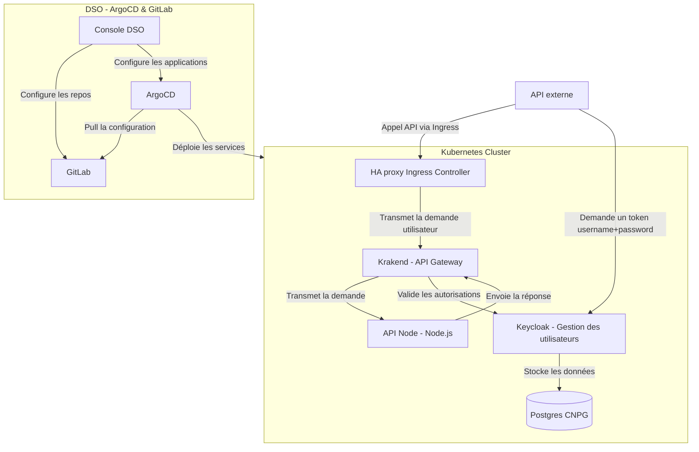
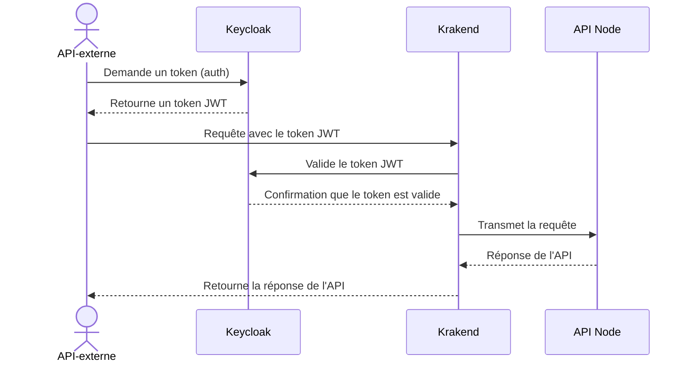

# Présentation du projet

Ce projet propose un déploiement d'application prototype en utilisant Helm. L'application se compose des éléments suivants :
- Krakend en tant que passerelle API (API Gateway / APIM)
- Keycloak pour la gestion des utilisateurs (SSO / IdP)
- Une base de données PostgreSQL pour les utilisateurs (CNPG cluster)

## Architecture

L'architecture repose sur plusieurs composants, notamment un contrôleur Ingress HAProxy (présent dans les clusters OpenShift) qui redirige les requêtes vers la passerelle Krakend. Celle-ci vérifie l'authentification et les rôles auprès de Keycloak, avant de transmettre, ou non, la requête vers l'API. Keycloak gère l'authentification des utilisateurs, tandis que les données sont stockées dans une base de données PostgreSQL CloudNativePG. 
Le déploiement des services est automatisé via ArgoCD, avec GitLab servant de source de configuration. 
La création du contenu dans ArgoCD et Gitlab et effectué par la [Console DSO](https://console.apps.dso.numerique-interieur.com/).



## Diagramme de séquence 
Ce diagramme de séquence illustre le processus d'authentification et de transmission des requêtes entre les différents composants de l'architecture.

Lorsqu'une API externe souhaite accéder à l'application, elle commence par demander un token d'authentification à Keycloak. Keycloak, responsable de la gestion des utilisateurs, génère et renvoie un token JWT à l'API externe. Ce token sert ensuite à authentifier la requête auprès de la passerelle Krakend, qui se charge de valider le token JWT en communiquant à nouveau avec Keycloak.

Une fois l'authentification confirmée, Krakend transmet la requête à l'API Node.js. L'API répond ensuite à Krakend, qui à son tour envoie la réponse finale à l'API externe, clôturant ainsi le cycle de la requête. Ce processus garantit que seules les requêtes authentifiées et autorisées accèdent à l'API.



## Krakend
Pour la passerelle API, nous utilisons le chart Helm Krakend [Voir la documentation](https://github.com/equinixmetal-helm/krakend/tree/main/), recommandé par Krakend, bien qu'il ne soit pas officiel.  

La [configuration flexible](https://www.krakend.io/docs/configuration/flexible-config/) de Krakend est utilisée pour implémenter les routes de manière plus efficace et concise. Ce choix permet également la configuration de plusieurs fonctionnalités comme les `CORS` et les `ratelimit` en interprétant dynamiquement certains paramètres. 

Il s'agit ici d'un exemple et les `endpoints` Krakend sont à modifier pour définir les chemins réellement exposés par l'API. 

Le chart Helm de Krakend est une dépendance, et il est nécessaire de configurer le `securityContext` pour être compatible avec Openshift. Un exemple d'implémentation se trouve dans le fichier `values-krakend.yaml`, où les templates de configuration sont définis.

## Keycloak
Keycloak est déployé à l'aide du chart Helm Bitnami Keycloak [Voir la documentation](https://github.com/bitnami/charts/tree/main/bitnami/keycloak).
 
Le chart Helm de Keycloak est une dépendance, et la fonctionnalité keycloak-config-cli est utilisée pour importer un "realm" configuré dans une ConfigMap (répertoire `templates/keycloak-realm-cm.yaml`). Un exemple d'implémentation se trouve dans le fichier `values-keycloak.yaml`, où les variables d'environnement (provenant de Secrets Kubernetes) sont définies et les ConfigMaps sont référencés.

## PostgreSQL
La base de données PostgreSQL est déployée à l'aide du chart CloudNativePG [Voir la documentation](https://github.com/cloudnative-pg/charts/tree/main/charts/cluster). 

Le chart Helm de CloudNativePG est une dépendance, et il est utilisé par Keycloak pour le stockage des données utilisateurs. Afin de gérer le cycle de vie de la base de données indépendamment des autres services, elle est maintenue dans un chart distinct de Keycloak, ce qui permet de prévenir les erreurs et d'optimiser la réutilisation des charts Helm, tout en permettant d'utiliser les différentes fonctionnalités de CNPG adaptées aux clusters Kubernetes telle que le backup vers S3 avec PgBackRest. Un exemple d'implémentation simple se trouve dans le fichier `values-cnpg.yaml`.

## Exemple de configuration

Les valeurs suivantes sont fournies à titre d'exemple ou sont des placeholders à modifier par le projet avant de déployer la solution (fichier `values.yaml`). Il s'agit de paramètres Krakend sous forme de templates json ou de variables d'environnement. En particulier, les routes à exposer sont à définir :

| Key | Values |
| --- | ------ |
| `settings.urls.json` | `APIHost`: URL du service Kube vers le back-end avec le port </br> `JWKUrl`: URL du service Kube vers l'IDP (ex. Keycloak) avec le port et le path du protocole </br> `CORSUrl`: URL de l'Ingress d'un éventuel front-end accédant aux ressources exposées par l'API |
| `templates.endpoints.tmpl` | `endpoint`: Path exposé par Krakend </br> `method`: Verbe concerné </br> `backend.url_pattern`: Path cible vers le back </br> `extra_config.auth/validator.Roles`: Liste des rôles de l'IdP autorisés pour l'endpoint |
| `ingress.host` | URL externe pour exposer Krakend (et donc l'API Gateway) |

L'exemple expose 3 endpoints, à savoir `/public` qui redirige vers une ressource `/swagger/json` du back-end sans authentification et `/private` qui redirige vers une ressource `/api/resource` du back-end avec validation d'autorisation (les rôles `admin`, `readwrite` & `readonly` peuvent effectuer un `GET` mais seuls les rôles `admin` & `readwrite` peuvent effectuer un `POST`), et enfin une ressource `/private/search` qui dispose de paramètres supplémentaires pour permettre la recherche et accepte la réponse sous forme de collection json (`backend.is_collection: true` et `input_query_strings: [*]`) :

```json
[
{
    "endpoint": "/public",
    "backend": [
        {
        "host": ["{{ $host }}"],
        "url_pattern": "/swagger/json",
        "extra_config": {
            {{ template "ratelimit_proxy" (dict "MaxRate" "100") }}
        }
        }
    ],
    "extra_config": {
        {{ template "ratelimit_router" (dict "Strategy" "ip" "Key" "") }}
    }
},
{
    "endpoint": "/private",
    "method": "GET",
    "backend": [
        {
        "host": ["{{ $host }}"],
        "url_pattern": "/api/resource",
        "extra_config": {
            {{ template "ratelimit_proxy" . }}
        }
        }
    ],
    "input_headers": {{ include "input_header.txt"}},
    "extra_config": {
        {{ template "auth_validator" (dict "JWKUrl" $JWKUrl "Roles" "[\"admin\", \"readwrite\", \"readonly\"]") }},
        {{ template "lua_proxy" . }},
        {{ template "ratelimit_router" . }}
    }
},
{
    "endpoint": "/private",
    "method": "POST",
    "backend": [
        {
        "host": ["{{ $host }}"],
        "url_pattern": "/api/resource",
        "extra_config": {
            {{ template "ratelimit_proxy" . }}
        }
        }
    ],
    "input_headers": {{ include "input_header.txt"}},
    "extra_config": {
        {{ template "auth_validator" (dict "JWKUrl" $JWKUrl "Roles" "[\"admin\", \"readwrite\"]") }},
        {{ template "lua_proxy" . }},
        {{ template "ratelimit_router" . }}
    }
},
{
    "endpoint": "/private/search",
    "backend": [
        {
        "host": ["{{ $Host }}"],
        "url_pattern": "/api/resource/search",
        "is_collection": true,
        "extra_config": {
            {{ template "ratelimit_proxy" . }}
        }
        }
    ],
    "input_headers": {{ include "input_headers.txt" }},
    "input_query_strings": ["*"],
    "extra_config": {
        {{ template "auth_validator" (dict "JWKUrl" $JWKUrl "Roles" "[\"admin\", \"readwrite\", \"readonly\"]") }},
        {{ template "lua_proxy" . }},
        {{ template "ratelimit_router" . }}
    }
}
]
```

La définition des endpoint fait appel à des templates qui permettent de factoriser les configuration récurrentes telles que `auth/validator`, `modifier/lua-proxy`, `qos/ratelimit/router` & `qos/ratelimit/proxy`.

---

## Sources et Références :
- [Documentation Krakend](https://www.krakend.io/docs/overview/)
- [Chart Helm Krakend](https://github.com/equinixmetal-helm/krakend/tree/main/)
- [Chart Helm Bitnami Keycloak](https://github.com/bitnami/charts/tree/main/bitnami/keycloak/)
- [Chart Helm CloudNativePG](https://github.com/cloudnative-pg/charts/tree/main/charts/cluster/)
- [Documentation Helm PostgreSQL](https://cloudnative-pg.io/documentation/1.24/)
