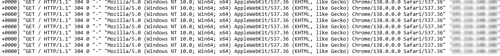

# Consultation de l'IP d'origine d'un client sur PAX uniquement

Ce tuto montre comment récupérer l'IP source depuis un POD. A noter que cela ne fonctionne que sur le déploiement PAX qui utilise un ingressController nginx.

## Récupération de l'IP source

L'IP source (real IP) est directement transmise aux POD applicatifs via les entêtes HTTP X-FORWARDED-*

Ainsi le chart de ce répertoire permet de récupérer cette information, une fois le déploiement fait, allez sur ArgoCD sur le POD et consulter les logs. Ma dernière information des logs (accesslog) correspond à l'IP du client.

